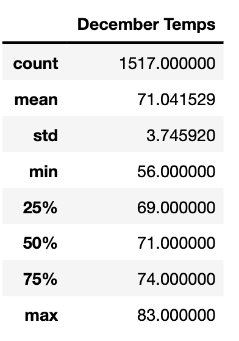
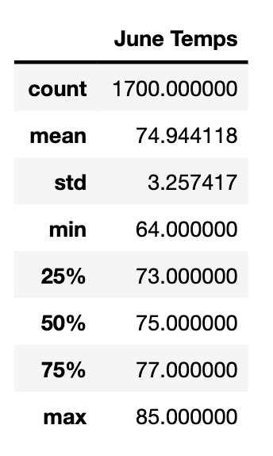

# Surfs_Up

## Overview  

The purpose of this analysis is to find information about the average temperature for June and December to determine whether W.Avy’s dream if the surf and ice cream shop business is sustainable year round. 

## Results 
•	Although June and December have around the same average temperature, the lowest temperature in December is much lower than in June. 

•	The max temperature for both months stay around the same, meaning that even in June the weather does not get too hot and also even in December, the temperature will still sometimes reach the mid 80s. 

•	The count for December Temperature is lower than the count for June Temperature, meaning that the data for June is more accurate than the data for December. 

## Images

## Summary
From the descriptive summary results about the weather statistics of December and June, I can conclude that the weather in Oahu is pretty stable year round, even during the summer and winter times, so I think that it is safe to open up a surf and ice cream shop in the island of Oahu.
